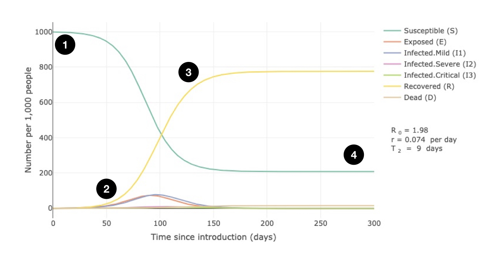
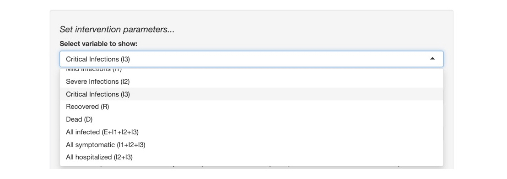
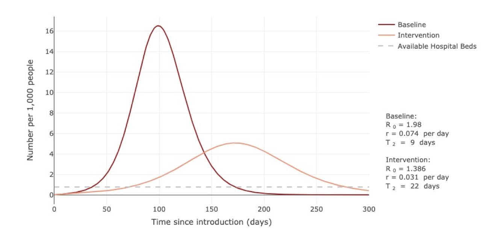
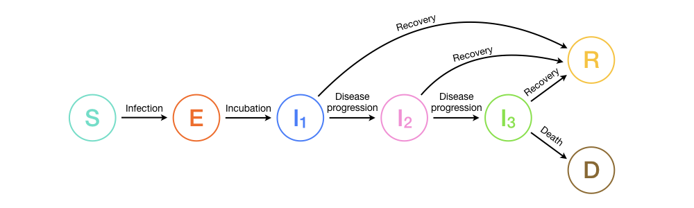

### Passos iniciais no app Shiny - Simulador COVID-19
 

#### Simulando propagação do COVID-19

Este app usa um modelo matemático para descrever como a COVD-19 se propaga em uma população de indivíduos que nunca foram expostos a doença previamente. A velocidade e extensão na qual a doença se espalha - e por consequência quanto ela pode sobrecarregar um sistema hospitalar - vai depender de um número de taxas relacionadas a  transmissão e progressão da doença, que podemos specificar utilizando os sliders na esquerda (mais sobre estes abaixo).Há, no entanto,  características gerais do percurso da epidemia (que podem ser visualizadas na aba **Propagação**) que merecem destaque:

1. No começo da simulação, todos os indivíduos estão livre da doença e suscetíveis (S) a infecção com COVID-19. 

2. Após o COVID-19 ser introduzido na população, indivíduos suscetíveis ficam doentes e o número de indivíduos infectados (I1, I2 e I3) aumentam, levando a um aumento no número dos que se recuperam (R) ou falecem (D).

3. Eventualmente, enquanto a doença faz seu caminho pela população, o número de indivíduos que se recuperam (R) da doença irá superar o número daquele que ainda não que ainda não obteram a doença (S). 

4. O surto termina quando não há mais indivíduos suscetíveis o suficiente para manter uma maior disseminação da doença.

 

#### Simulando intervenções e seus impactos na capacidade hospitalar

Enquanto a aba **Propagação**  nos permite visualizar a propagação do COVID-19 **_na ausência de qualquer intervenção_**, as abas de **Intervenção** e **Capacidade**  fornecem controles adicionais que nos permitem simular os efeitos de intervenções que reduzem a transmissão da doença. Estas abas incluem controles para especificar o tipo de intervenção (por ex., o grau em que a transmissão é reduzida e em quais tipos de infecções, assim como ostempos de início de término das intervenções) e especifica os valores utilizados para calcular a capacidade hospitalar geral. Nós podemos escolher o desfecho a ser monitorado utilizando o menu drop-down localizado abaixo de **Selecionar variável a ser apresentada**.

O gráfico exemplo abaixo mostra o número de indivíduos com infecções graves ou críticas (I2 + I3) ao longo do tempo em um cenário padrão sem qualquer intervenção (linha vermelho-escuro) vs uma intervenção (linha vermelho-claro). É evidente a partir do gráfico que esta intervenção em particular reduz o número ápice de indivíduos doentes significativamente, de 16.5 a cada 1,000 indivíduos no dia 99 para 5 a cada 1,000 indivíduos no dia 172. Entretanto, essa redução não chega a ponto de prevenir uma sobrecarga na capacidade hospitalar, que ocorre quando o número de indivíduos doentes supera o número de leitos disponíveis (linha cinza pontilhada).

 

#### Como o modelo funciona?

O modelo funciona monitorando a situação infeccional de cada indivíduo na população em cada ponto no tempo da simulação. O diagrama a seguir mostra os possíveis estados da doença que um indivíduo pode atingir no contexto da COVID-19. Todas as possíveis transições entre estados são representadas por flechas e rotuladas com uma breve descrição.

Mais informação sobre cada estado e suas transições são dadas abaixo:

* **Suscetíveis (S):** Indivíduos suscetíveis são aqueles que nunca foram infectados com o vírus e portanto não possuem nenhuma imunidade contra o mesmo. Indivíduos suscetíveis se tornam expostos no momento em que são infectados.

* **Expostos (E):** Indivíduos expostos são aqueles que foram infectados com COVID-19 mas ainda não transmitem a doença para outros. Um indivíduo permanece no estado exposto durante a extensão do período de incubação, depois do qual eles passam a transmitir a doença e passam a apresentar leves sintomas clínicos (I1).

* **Infectado - Leve (I1):** Indivíduos com uma infecção leve apresentam sintomas como febre e tosse e podem até ter pneumonia leve mas não necessitam de hospitalização/internação. Estes indivíduos podem ou se recuperar, ou progredirem ao estado grave da doença. 

* **Infectado - Grave (I2):** Indivíduos com uma infecção grave têm pneumonia grave e necessitam de internação. Estes indivíduos podem ou se recuperar, ou progredirem ao estado crítico da doença.

* **Infectado - critical (I3):** Indivíduos com uma infecção crítica apresentam insuficiência respiratória, choque séptico, e/ou disfunção múltipla dos órgãos necessitam de tratamento em uma UTI. Estes indivíduos podem ou se recuperar ou virem a óbito.

* **Recuperados (R):** Indivíduos recuperados são aqueles que não estão mais infectados e presume-se que estes são imunes a infecções futuras.

* **Mortos (D):** Indivíduos mortos são aqueles que vieram a óbito devido a COVID-19.

 

#### O que cada slider faz?

Os controles deslizantes no lado esquerdo da interface controlam vários parâmetros de taxas relacionadas a progressão clínica da doença e transmissão do vírus. Valores padrões são tirados da literatura (ver aba **Fontes**), mas podemos alterar estes parâmetros para compreender como a doença se espalha sob diferentes cenários. Nós podemos também alterar qualquer parâmetro para compreender melhor como ele impacta o percurso e desfecho de uma epidemia. Uma breve explicação de cada controle e o parâmetro que ele controla é dada abaixo:

#### *Parâmetros Clínicos*

* **Duração do período de incubação:** define o período necessário para que um indivíduo que foi recém infectado com COVID-19 se torne um transmissor da doença para outros.

* **Duração da infecção leve:** define o período em que uma pessoa adoece com sintomas leves de COVID-19 antes que estas se recuperem  ou progridam ao estado grave da doença.

* **Fração de infecções que são graves:** define a porcentagem de infecções que avançam ao estado grave.

* **Fração de infecções que são críticas:** define a porcentagem de infecções que avançam ao estado crítico.

* **Taxa de mortalidade para infecções críticas:** define a porcentagem de infecções críticas que levam a morte. Este valor, junto da porcentagem de infecções que são críticas, determinam a razão de fatalidade de casos (CFR),  que nos diz o percentual de todos os indivíduos com a doença que eventualmente morrem. 

* **Duração de infecção grave (internação):** define o período em que indivíduos permanecem no estado grave da doença antes de ou se recuperarem ou avançarem ao estado crítico da doença.

* **Duração de infecção crítica (internação em UTI):** define o período de tempo em que indivíduos permanecem em estado crítico antes de ou se recuperarem ou virem a óbito.

#### *Valores de Transmissão*

* **Taxa de Transmissão (infecções leves):** define a taxa na qual os indivíduos com uma infecção leve transmitem a doença para outros. Já que estes são os mais prováveis a ainda estarem presente na comunidade (não internados) e não saberem que estão infectados, este é provavelmente o modo dominante de transmissão. 

* **Taxa de Transmissão (infecções graves):** define a taxa na qual os indivíduos com uma infecção grave transmitem a doença para outros. Já que estes indivíduos provavelmente estarão no hospital, é provável que eles propaguem a doença numa velocidade muito menor do que aqueles com infecções leves. 

* **Taxa de Transmissão (infecções críticas):** define a taxa na qual os indivíduos com uma infecção crítica transmitem a doença para outros. Já que estes indivíduos provavelmente estarão no hospital, é provável que eles propaguem a doença numa taxa similar àqueles com infecções graves e numa velocidade muito menor do que aqueles com infecções leves. 

#### *Valores de Simulação*

* **Tamanho populacional total:** Define o tamanho da população dentro da simulação.

* **Número Inicial de Infectados:** Define o número de indivíduos infectados no ínicio da simulação. Os primeiros indivíduos infectados começam na classe "Expostos". 

* **Tempo Máximo:** define o período máximo de tempo a ser mostrado nos gráficos.

 

#### Tente Você Mesmo

Os seguintes exercícios podem ajudar a se familiarizar com o app. Clique no botão **Resetar Tudo** no canto inferior esquerdo entre exercícios para retornar os controles aos seus valores padrões.

* **Aumente a duração do período de incubação de 5 dias para 10-20 dias e observe como o percurso da epidemia ao longo do tempo se altera.** _Quais mudanças você observa quando o período de incubação é aumentado? Como essas mudanças alteran a proporção de indivíduos que estão expostos vs infectados? Esse aumento alterou o número de indivíduos infectados com COVID-19? (Dica: Você pode estimar o número total de pessoas que ficam doentes como o número de indivíduos que se recuperaram até o término da simulação)_

* **Aumente a duração de infecções leves de 6 dias para 8 dias e observe como a epidemia se altera. Agora diminua a duração para 5 dias.** _De que forma aumentar o período em que alguém está doente e transmite COVID-19 impacta o número total de pessoas que ficam doentes? E qual o impacto de diminuírmos esse período? Por que isso ocorre?_

* **Altere a taxa de transmissão de infecções leves e note como as mudanças neste parâmetro mudam os valores de $R_0$, que está a mostra no lado direito do gráfico** _$R_0$ nos diz o número médio de outras pessoas que um único indivíduo doente infecta dentro de uma população completamente suscetível. O que você acha que acontece com a epidemia quando $R_0$ é maior que 1? E quando $R_0$ é menor que 1? Mude a taxa de transmissão de modo que $R_0$ seja <1 e veja o que acontece._ 

